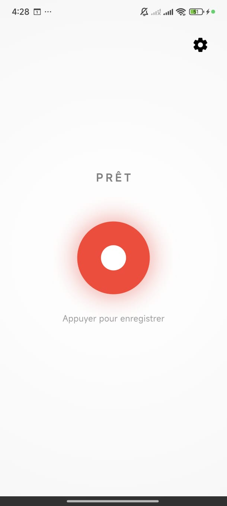
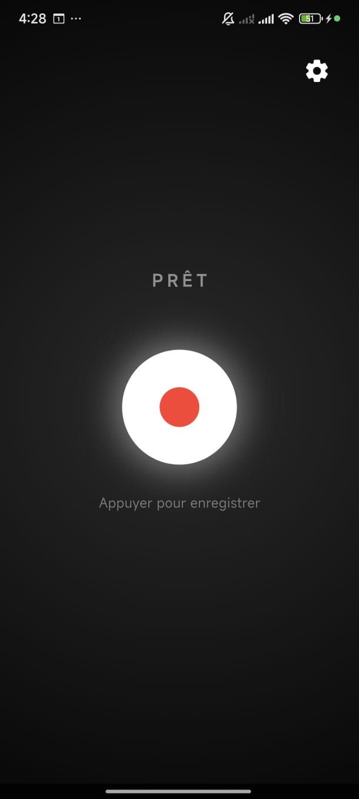
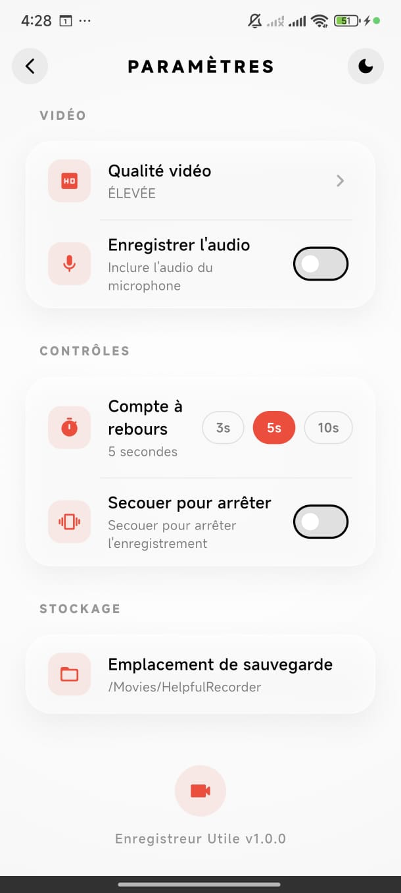
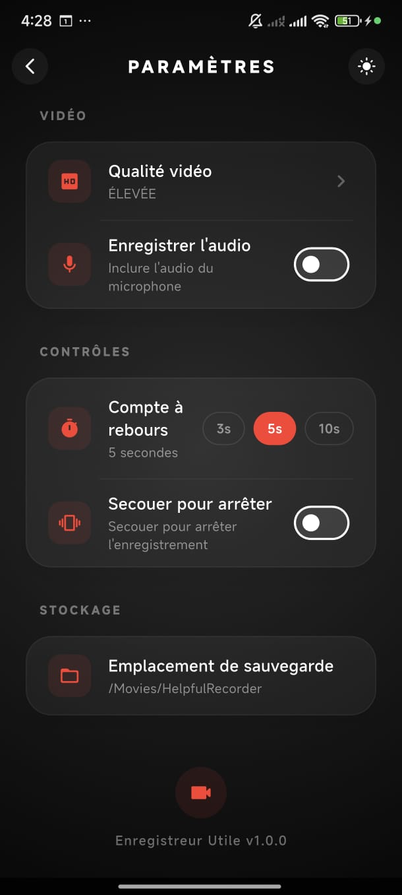

# Helpful Recorder


**Helpful Recorder** is an enterprise-grade screen recording solution engineered for Android, leveraging the cross-platform capabilities of Flutter and the performance of native Kotlin APIs. Designed with a focus on reliability, performance, and user experience, it offers a comprehensive suite of tools for content creators, developers, and educators.

The application adheres to modern architectural standards, implementing Clean Architecture and the BLoC pattern to ensure scalability, testability, and maintainability.

---

## 📸 Interface Overview

The user interface is designed using Glassmorphism principles, providing a sleek, modern aesthetic that adapts seamlessly to system themes.

| Light Mode | Dark Mode |
|:---:|:---:|
|  |  |
|  |  |

---

## ✨ Core Features

### 🎥 High-Fidelity Screen Capture
- **Configurable Resolution**: Support for 1080p, 720p, and 480p recording resolutions to balance quality and file size.
- **Optimized Bitrate**: Automatic bitrate adjustment based on selected resolution for optimal visual fidelity.
- **Hardware Acceleration**: Utilizes the device's native H.264 encoder via `MediaRecorder` for low-latency, high-performance encoding.
- **Frame Rate Control**: Targets 60 FPS for smooth motion capture.

### 🎙️ Audio Management
- **Internal Audio Capture**: Direct recording of internal system audio (Android 10+).
- **Microphone Input**: Optional microphone recording for voiceovers and commentary.
- **Synchronized Streams**: Ensures perfect synchronization between video and audio tracks.

### ✏️ Live Telestrator (Annotation Suite)
A robust set of on-screen drawing tools designed for real-time annotation.
- **Native Overlay System**: Implemented using `WindowManager` for a lag-free drawing experience over any application.
- **Customizable Tools**:
  - **Color Palette**: 6 professional colors (Red, Blue, Green, Yellow, White, Black).
  - **Stroke Width**: Adjustable pen size for precise highlighting.
- **Gesture Control**:
  - **Undo/Redo**: Non-destructive editing of annotations.
  - **Clear All**: Instant canvas reset.
- **Global Persistence**: The annotation layer remains active across application switches, enabling multi-app tutorials.

### 🎮 Advanced Control System
- **Floating Control Widget**: A non-intrusive, draggable overlay providing instant access to recording controls.
  - **Quick Actions**: Start, Stop, Pause, Resume, and Restart.
  - **Draw Toggle**: Immediate access to annotation tools.
  - **Auto-Foreground**: Automatically brings the application to the foreground upon recording completion for immediate review.
- **Gesture Navigation**: Shake-to-stop functionality for a button-free recording termination.
- **Touch Visualization**: Optional visual feedback for user interactions, ideal for instructional videos.

---

## 🛠️ Technical Architecture

The project is structured following **Clean Architecture** principles, ensuring separation of concerns and modularity.

### 📱 Flutter Layer (Presentation & Domain)
- **State Management**: Implements the **BLoC (Business Logic Component)** pattern for predictable state transitions and reactive UI updates.
- **Dependency Injection**: Utilizes `get_it` for efficient service location and dependency management.
- **Platform Channels**: Custom `MethodChannel` implementations for low-latency communication with native Android components.
- **UI Components**: Modularized widget library following Atomic Design principles (Atoms, Molecules, Organisms).

### 🤖 Android Layer (Native Implementation)
- **MediaProjection API**: Secure handling of screen capture permissions and virtual display creation.
- **Foreground Service**: `ScreenRecorderService` ensures process priority and continuous recording even when the app is backgrounded.
- **Window Management**: sophisticated handling of `TYPE_APPLICATION_OVERLAY` windows for the floating controls and drawing canvas, ensuring correct Z-ordering and touch event propagation.
- **Scoped Storage**: Compliant with Android 10+ storage mandates using `MediaStore` API for secure file handling.

---

## ⚙️ Configuration Parameters

| Parameter | Options | Default | Description |
|:---|:---|:---|:---|
| **Video Quality** | High (1080p) / Medium (720p) / Low (480p) | High | Determines the resolution and encoding bitrate. |
| **Audio Source** | Microphone / Internal / Mute | Microphone | Selects the audio input source. |
| **Countdown** | 3s / 5s / 10s | 5s | Pre-recording delay buffer. |
| **Shake Sensitivity** | On / Off | Off | Enables accelerometer-based stop gesture. |
| **Touch Indicators** | On / Off | Off | Renders visual feedback for touch events. |

---

## 🚀 Deployment & Setup

### Prerequisites
- **Flutter SDK**: Version 3.19.0 or higher.
- **Android SDK**: API Level 34 (Android 14) recommended; minimum API 24 (Android 7.0).
- **Java Development Kit (JDK)**: Version 17.

### Build Instructions

1.  **Clone the Repository**
    ```bash
    git clone https://github.com/yourusername/helpful_recorder.git
    cd helpful_recorder
    ```

2.  **Install Dependencies**
    ```bash
    flutter pub get
    ```

3.  **Run in Debug Mode**
    ```bash
    flutter run
    ```

4.  **Build Release APK**
    ```bash
    flutter build apk --release --split-per-abi
    ```


---

## 📄 License

This project is licensed under the **MIT License**. See the [LICENSE](LICENSE) file for full text.

---

**Helpful Recorder** — Professional Screen Recording Solutions.
